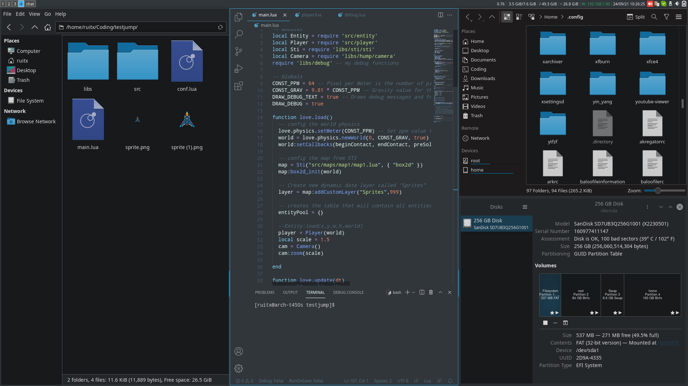

# i3-config
> My personal i3 config





## Installation

Base packages
```
pacman -S i3-gaps i3status i3lock python-i3ipc dmenu noto-fonts ttf-fantasque-sans-mono xterm htop nethogs arandr volumeicon dunst feh picom udiskie unclutter xorg-xinput xfce4-power-manager tlp cpupower polkit polkit-gnome polkit-qt5 networkmanager breeze breeze-gtk qt5ct lxappearance capitaine-cursors arc-icon-theme archlinux-wallpaper thunar tumbler ffmpegthumbnailer thunar-archive-plugin mousepad firefox neofetch scrot xdg-user-dirs lightdm lightdm-gtk-greeter lightdm-gtk-greeter-settings git gvfs gvfs-smb gvfs-mtp powertop pulseaudio pulseaudio-alsa alsa-utils pavucontrol ufw gufw gnome-keyring seahorse nano-syntax-highlighting xarchiver unrar
```
Install ```yay```
```
pacman -S --needed base-devel
cd /tmp/ && git clone https://aur.archlinux.org/yay.git
cd yay && makepkg -si
```
AUR packages
```
yay -S clipit spotify skypeforlinux-stable-bin thunar-shares-plugin teamviewer
```

## Configuration
Copy the files from this repo and put them in ~/.

Change the permissions to execute on scripts folder
```
cd ~/.config/i3/scripts
chmod +x *
``` 
Enabling services
``` 
systemctl enable lightdm
systemctl enable tlp
systemctl enable ufw
systemctl enable teamviewerd
```
### Terminal config
```echo "TERMINAL=xterm" >> /etc/environment```

The colors and other settings should be already on .Xresources

### Nano
Config ```/etc/nanorc``` for syntax highlighting, mouse support, auto identation, tab defaults to 4 spaces
```
inlcude /usr/share/nano-syntax-highlighting/*.nanorc
set mouse
set autoindent
set tabsize 4
set tabstospaces
```

### Appearance
#### Auto
Copy .config files. GTK should already be set. QT5 only needs ```echo "QT_QPA_PLATFORMTHEME=qt5ct" >> /etc/environment```

Copy ```lightdm-gtk-greeter.conf``` to ```/etc/lightdm/```

#### Manual
GTK : Open `lxappearance` and change:
* Font to `Noto Sans`
* Widget to `Breeze`
* Icon theme to `Arc`
* Mouse Cursor to `Capitaine Cursors`

QT : Open `qt5ct` and change:
* Style to `Breeze`
* Fonts to `Noto Sans` and `Fantasque Sans Mono`
* Icon theme to `Arc`
Then add `echo "QT_QPA_PLATFORMTHEME=qt5ct" >> /etc/environment`

Open `lightdm-gtk-greeter-settings-pkexec` and change:
* Theme to 'Breeze-Dark`
* Icons to `Arc`
* Font to `Fantasque Sans Mono Regular`
* Change background color to `#2a2e32`
* Disable user image

